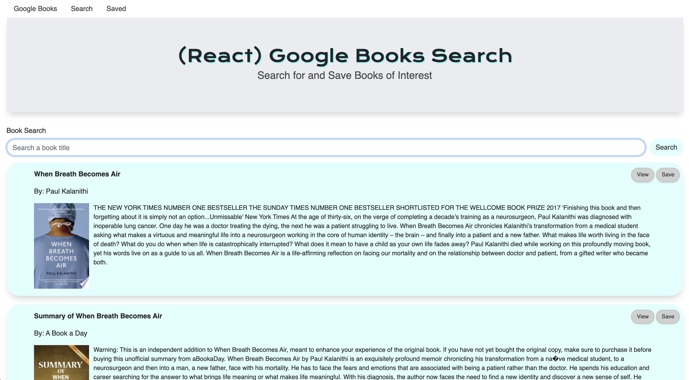

# Google-Books-React-Search
[](https://opensource.org/licenses/MIT)

## Table of Contents
- [Description](#description)
- [Installation](#installation)
- [Usage](#usage)
- [License](#license)
- [Contributing](#contributing)

## Description
A MERN stack application that allows users to search for books using the Google Books API and save books into the MongoDB database using Mongoose.

## Installation
Clone or download the package and open terminal in the package directory. Then run the following command to install all the dependencies into the local node_modules folder:

```
npm i
```

## Usage

```
npm start
```
Runs the app in the development mode.<br />
Open [http://localhost:3000](http://localhost:3000) to view it in the browser.

Deployed application link [here](https://infinite-wildwood-82416.herokuapp.com/search).

The application will look something like this:



## License
Licensed under the MIT License.

## Contributing
To contribute directly to the code base, please see this [How to Contribute](https://github.com/Microsoft/vscode/wiki/How-to-Contribute) document.
